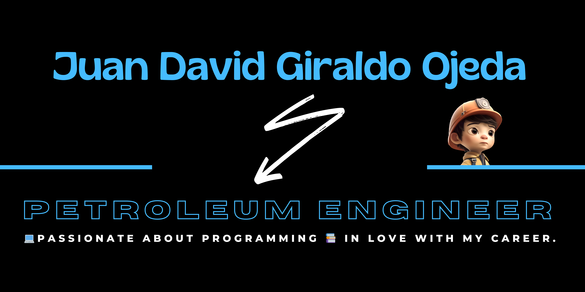

# Hola, Mi Nombre es Juan David Giraldo, Bienvenido a mi GITHUB 👋

[?style=for-the-badge&logo=linkedin&logoColor=white)](https://www.linkedin.com/in/juandgo/)

#### Ingeniero de Petróleos egresado de la Universidad Surcolombiana.

Cuento con un año de experiencia en la
petrolera Halliburton, en el área de logística.
Donde adquirí nuevos conocimientos en
manejo de inventarios, procesos de
transporte de equipos petroleros en
importaciones y exportaciones.

Actualmente me encuentro en proceso de
aprendizaje del lenguaje de programación
Python, bases de datos SQL y GIT, con un
enfoque en adquirir competencias sólidas en
el manejo de datos.

